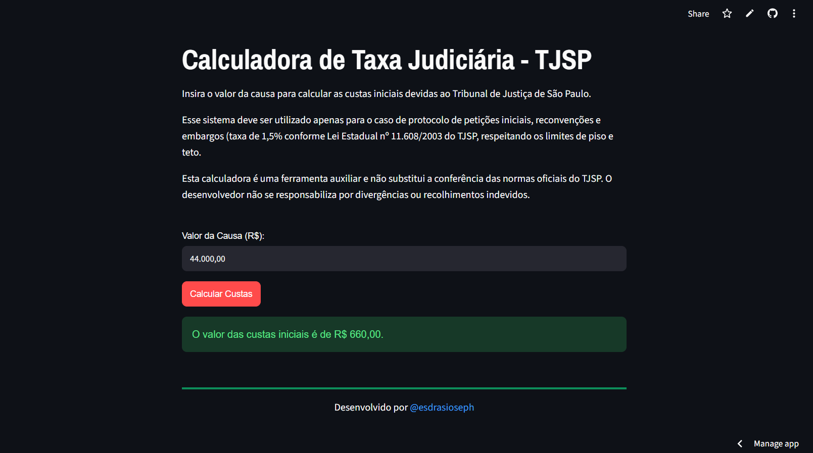

# Calculadora de Custas Judiciais - TJSP

Projeto desenvolvido com o objetivo de auxiliar advogados, estagiários e profissionais do direito para facilitar o cálculo da taxa judiciária necessária para o ingresso de petições iniciais junto ao Tribunal de Justiça do Estado de São Paulo (TJSP).

**[Acesse a Calculadora Online](https://calculadora-custas-tjsp.streamlit.app)**

---

## Sobre o Projeto 

O algoritmo calcula o valor da taxa judiciária devida no momento do protocolo de petições iniciais, reconvenções e embargos à execução.

O cálculo é realizado com base no percentual de 1,5% a incidir sobre o valor da causa, observando-se as disposições constantes do art. 4º, I e § 1º da Lei nº 11.608 de 29 de dezembro de 2003.

---

## Preview

---

## Funcionalidades 

**Tratamento Flexível de Entradas:** Aceita valores formatados de diferentes formas, seja com ausência de pontuação, seja com utilização de ponto, vírgula ou até mesmo o símbolo 'R$'.

**Validação de Entrada e Orientação ao Usuário:** O sistema identifica valores numéricos inválidos, iguais ou menores que zero e orienta o usuário.

**Interface Personalizada:** Estilização customizada com CSS.

**Tratamento de Saída:** Utilização da biblioteca Babel para formatação da moeda no padrão brasileiro.

---

## Tecnologias Utilizadas

**Python:** É a linguagem básica do projeto.

**Streamlit:** Framework para construção da interface web.

**Babel:** Biblioteca para formatação dos valores monetários no padrão brasileiro.

**CSS3:** Linguagem de estilização utilizada para customização visual dos elementos.

---

## Como Executar o Projeto Localmente

### Pré-requisitos
* **Python 3.8+** instalado.
* **Git** instalado.

---

1. **Clone o Repositório:**

git clone [https://github.com/esdrasioseph/calculator-custas-tjsp.git](https://github.com/esdrasioseph/calculator-custas-tjsp.git)
cd calculator-custas-tjsp

---

2. **Crie e ative um Ambiente Virtual**:

* Linux/MacOS:

python3 -m venv venv
source venv/bin/activate

* Windows:

python -m venv venv
.\venv\Scripts\activate

---

3. **Instale as Dependências:**

pip install -r requirements.txt

---

4. **Execute a Aplicação:**

streamlit run app-web.py

---

## Autor 

Desenvolvido por **Esdras Ioseph**. 

Estudante de Análise e Desenvolvimento de Sistemas.

* [Github](https://github.com/esdrasioseph)

